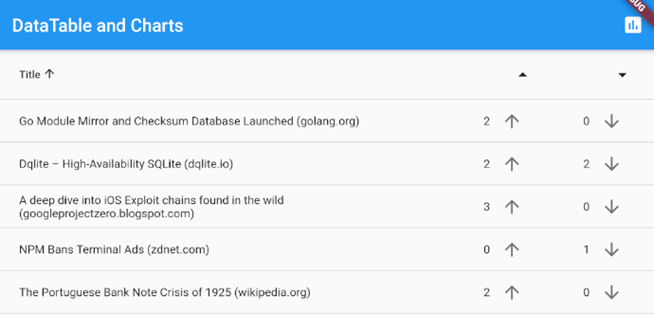
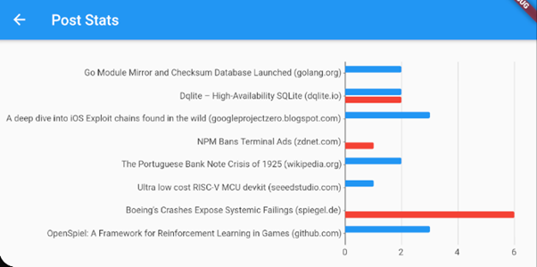

# Lab 08
The starter code for lab 08.

## Overview
For this lab, you will develop a rudimentary social network, roughly modelled after _Hacker News_ (https://news.ycombinator.com/).  The app will display a sortable `DataTable` of stories with their up votes and down votes, as well as icon buttons allowing the user to increase the number of up/down votes.

_**Note:**  The user will be able to press the up arrow or down arrow icon as many times as they like.  We're not keeping track of which users have voted already._

## Instructions

### The Post Class and Sample Data
The Post class will consist of the following fields:
- `title` (`String`)
- `numUpVotes` (`int`)
- `numDownVotes` (`int`)

This class will also have a static function (`generateData()`) which will return some (5-10) sample `Post`s.

### Creating the DataTable
The `DataTable` will consist of three columns:
- `title` (not numeric)
- `numUpVotes` (numeric)
- `numDownVotes` (numeric)

This `DataTable` will be similar to the in-class demo, but will not support selection or editing.  It will support sorting on all three columns, however.  The data for this table will be taken from the `generateData()` method on the `Post` class.

The `title` column will merely display a simple `Text` widget.  The other two columns will generate both a `Text` widget (to display the current value), and an `IconButton` (to allow the user to change the value).  A screenshot of the desired table appearance, is shown below:

_Figure 1 - The DataTable_

Please note the app bar at the top, which has a chart icon to take you to the chart page (described in the next section).

### The Chart
The widget containing the `DataTable` will pass its post data to this widget, as an argument.  This widget will generate a horizontal bar chart with two series:
- up votes
- down votes

The post's title will be used as the domain for both series.  A screenshot of the desired chart is shown below:

 
_Figure 2 - The bar chart_

## Getting Help
If you run into difficulty, you may wish to check out some of the following resources:

- https://api.flutter.dev/  - The standard documentation for Flutter, all classes and methods.
- https://dart.dev/tutorials - A series of tutorials for the Dart programming language, focusing entirely on the features of Dart.
- https://flutter.dev/docs/reference/tutorials - A series of tutorials for the Flutter platform, focusing mainly on the widgets and API.
- https://flutter.dev/docs/codelabs - A series of deep-dive, more comprehensive, tutorials to learn more about the Flutter platform.
- https://flutter.dev/docs/cookbook - A set of recipes for commonly used features of Flutter.
- https://github.com/flutter/samples/blob/master/INDEX.md - A repository containing some completed Flutter applications.
- http://stackoverflow.com/ - A forum for asking questions about programming.  I bet you know this one already!

Of course, you can always ask the TA for help!  However, learning how to find the answers out for yourself is not only more satisfying, but results in greater learning as well.

## How to Submit
Create your flutter project inside this folder, commit, and then push your code to this repository to submit your lab assignment.